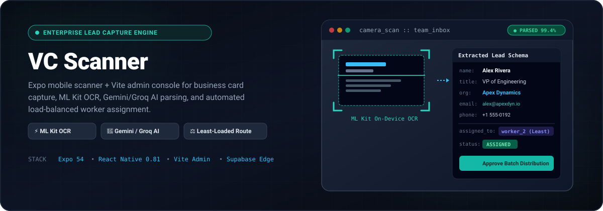
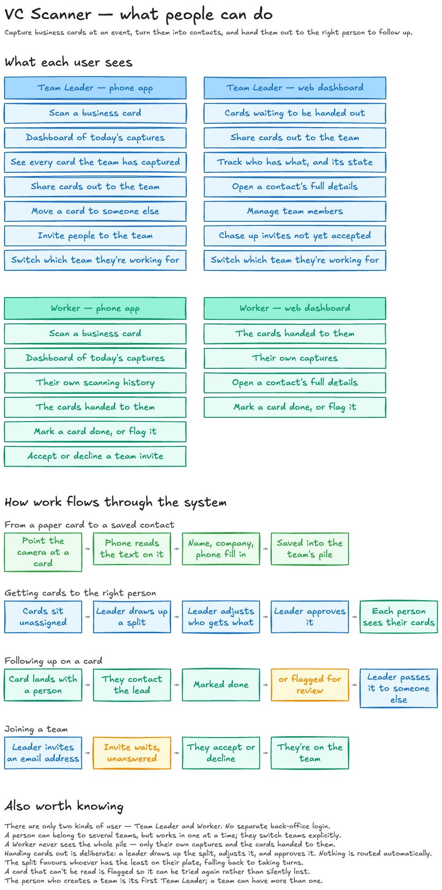
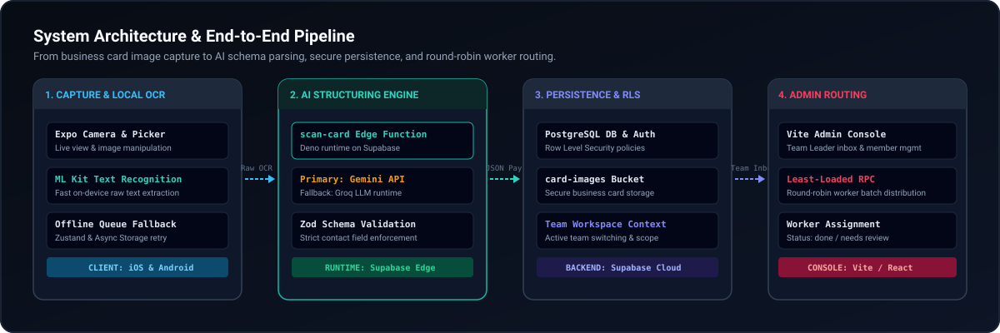

<p align="center">
  
</p>

<p align="center">
  <b>High-speed mobile business card scanner + Vite admin console powered by on-device OCR, Supabase Edge Functions, AI contact parsing, and load-balanced team assignment.</b>
</p>

<p align="center">
  <a href="#apps--architecture">Apps</a> •
  <a href="#key-capabilities">Capabilities</a> •
  <a href="#user-flows">User Flows</a> •
  <a href="#system-architecture">Architecture</a> •
  <a href="#domain-model">Domain Model</a> •
  <a href="#environment--configuration">Setup</a> •
  <a href="#verification--testing">Verification</a>
</p>

---

## 📱 Apps & Architecture

`VC Scanner` is a full-stack solution built for event sales and lead capture teams. It comprises two clients backed by Supabase infrastructure:

| Component | Technology | Purpose | Location |
| :--- | :--- | :--- | :--- |
| **Mobile App** | Expo 54 / React Native 0.81 | On-device card capture, ML Kit OCR text extraction, offline queue, and worker lead view | Root (`./`) |
| **Admin Web Console** | Vite / React | Team Leader dashboard for team inbox curation, member invites, and batch lead assignment | [`./admin-web`](./admin-web) |
| **AI Parsing Runtime** | Supabase Edge Function (Deno) | Structured contact extraction using Gemini API with Groq LLM fallback & Zod validation | [`./supabase/functions/scan-card`](./supabase/functions/scan-card) |
| **Backend & Storage** | Supabase PostgreSQL + Storage | Row Level Security (RLS), `card-images` bucket, and RPC batch distribution | Hosted Supabase |

---

## 🚀 Key Capabilities

- **⚡ On-Device OCR Extraction**  
  Uses `@react-native-ml-kit/text-recognition` for real-time, low-latency text recognition directly on physical mobile devices.
- **🤖 Dual-Engine AI Contact Structuring**  
  Calls the `scan-card` Supabase Edge Function to extract structured contact data (`name`, `title`, `org`, `email`, `phone`, `website`, `address`, `socials`, `notes`) using Gemini API as primary and Groq LLM as fallback.
- **📦 Offline Queue & Local Storage**  
  Persists offline scans via Zustand and `@react-native-async-storage/async-storage`, automatically retrying once network connectivity is restored.
- **👥 Multi-Tenant Team Workspaces**  
  Supports team context switching via `user_team_contexts`. Team Leaders manage invites, while Workers view only their assigned leads.
- **⚖️ Load-Balanced Batch Assignment**  
  Team Leaders curate the **Team Inbox** and trigger batch distribution powered by custom Supabase RPC functions (`approve_team_assignment_batch`) using a least-loaded worker strategy with round-robin fallback.
- **📋 Assignment Workflow Management**  
  Track review status (`pending`, `needs review`, `done`) with bottom sheet interfaces (`TeamAssignmentBatchSheet`, `TeamReassignSheet`) for quick lead editing and reassignment.

---

## 🗺️ User Flows

What each role sees across both clients, and how a card moves from capture to follow-up:

<p align="center">
  
</p>

---

## 🏗️ System Architecture

<p align="center">
  
</p>

```
  [ Mobile App (Expo) ] ──(Raw OCR Text)──► [ Supabase Edge: scan-card ]
         │                                         │
 (Local Queue Retry)                               │ (Gemini / Groq LLM)
         ▼                                         ▼
  [ On-Device ML Kit ]                     [ Structured JSON ]
                                                   │
                                                   ▼
  [ Admin Web (Vite) ] ◄──(Batch RPC)── [ Supabase DB & Storage ]
```

---

## 📘 Domain Model

`VC Scanner` enforces strict domain language across mobile, web, and database boundaries:

| Term | Definition | Context & Boundaries |
| :--- | :--- | :--- |
| **Team** | The shared event boundary where business cards are captured and stored | A user has one active team at a time; created by a Team Leader |
| **Team Leader** | User who manages team membership, sends invites, and assigns scans | Can view full Team Inbox, edit batches, and reassign leads |
| **Worker** | Team member who receives assigned lead scans for follow-up | Can see **only** assigned scans in their personal inbox |
| **Team Inbox** | Unassigned card captures awaiting review and assignment | Visible to Team Leaders for batch distribution |
| **Batch Assignment** | Manual bulk routing of captured scans to workers | Uses least-loaded worker routing with round-robin fallback |
| **Pending Invite** | Team invitation sent to an email address | Requires accept/decline dialog; becomes a Membership when accepted |
| **Assignment State** | Review state of a worker lead assignment | `pending` ➔ `needs review` ➔ `done` |

---

## 🛠️ Environment & Configuration

### 1. Environment Files

#### Mobile / Root (`.env`)
```ini
SUPABASE_URL=https://<your-project>.supabase.co
SUPABASE_ANON_KEY=<your-anon-key>
EXPO_PUBLIC_SUPABASE_URL=https://<your-project>.supabase.co
EXPO_PUBLIC_SUPABASE_ANON_KEY=<your-anon-key>
GROQ_API_KEY=<your-groq-api-key>
```

#### Admin Web (`admin-web/.env.local`)
```ini
VITE_SUPABASE_URL=https://<your-project>.supabase.co
VITE_SUPABASE_ANON_KEY=<your-anon-key>
VITE_APP_URL=http://localhost:5173
VITE_AUTH_REDIRECT_URL=http://localhost:5173
```

#### Edge Function Runtime Secrets
Set secrets for the hosted Supabase project:
```bash
supabase secrets set SUPABASE_URL=https://<your-project>.supabase.co \
  SUPABASE_ANON_KEY=<your-anon-key> \
  GEMINI_API_KEY=<your-gemini-api-key> \
  GROQ_API_KEY=<your-groq-api-key>
```

---

### 2. Auth & Deep Link Setup

Configure the Supabase Auth project redirect allowlist for both mobile and web:

- **Mobile OAuth Callback Scheme**: `vcscanner://auth/callback`
- **Admin Web Callback**: `<your-admin-web-origin>/` (and preview URLs)
- **Supported Auth Providers**: Google OAuth and Email Auth (Password / Magic Link)

> [!IMPORTANT]
> Configure real SMTP credentials and production email templates in Supabase before deploying client releases.

---

### 3. Mobile Release Metadata

- **Android Application ID**: `com.vsscanner.app`
- **iOS Bundle Identifier**: `com.vsscanner.app`
- **Expo Scheme**: `vcscanner`

---

## 🧪 Verification & Testing

Run verification commands across client and backend workspaces:

### Root & Mobile App
```bash
# Typecheck TypeScript sources
npm run typecheck

# Run Jest unit and component tests
npm test

# Test Supabase Edge Functions with Deno
npm run test:supabase-functions

# Verify Expo Web bundle build
npm run web:build
```

### Admin Web App
```bash
cd admin-web

# Run Admin Web unit tests
npm run test

# Production build verification
npm run build
```

---

## 📁 Repository Structure

```
VC-Scanner/
├── App.tsx                       # Main Expo Mobile entrypoint & bottom sheet orchestration
├── src/                          # Mobile components, screens, hooks, & stores
│   ├── components/               # UI components (MetricRail, TeamAssignmentBatchSheet, etc.)
│   ├── hooks/                    # Custom hooks (useTeamWorkspace, etc.)
│   └── services/                 # OCR, camera, & API integration services
├── admin-web/                    # Vite / React Admin Console
│   ├── src/                      # Admin web components, pages, & Supabase client
│   └── package.json              # Admin web scripts & dependencies
├── supabase/                     # Backend infrastructure
│   ├── functions/scan-card/      # Deno Edge Function for AI contact parsing (Gemini/Groq)
│   └── migrations/               # PostgreSQL schema & RPC function migrations
├── docs/                         # Documentation & release procedures
│   ├── release-checklist.md      # Step-by-step production release checklist
│   └── adr/                      # Architectural Decision Records
└── .github/assets/               # GitHub README visual assets (hero & architecture SVG)
```

---

## 📋 Release Checklist

Before submitting builds to Apple App Store Connect or Google Play Console, follow the instructions in [`docs/release-checklist.md`](./docs/release-checklist.md).
